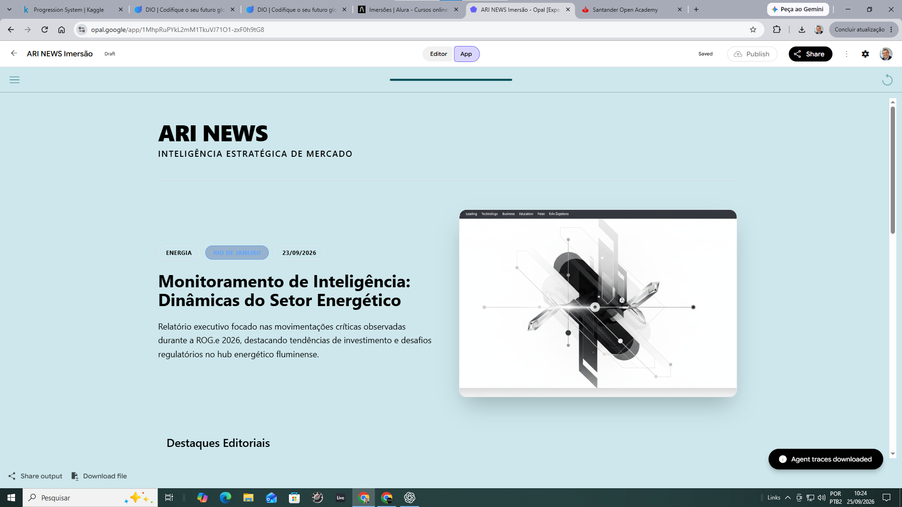
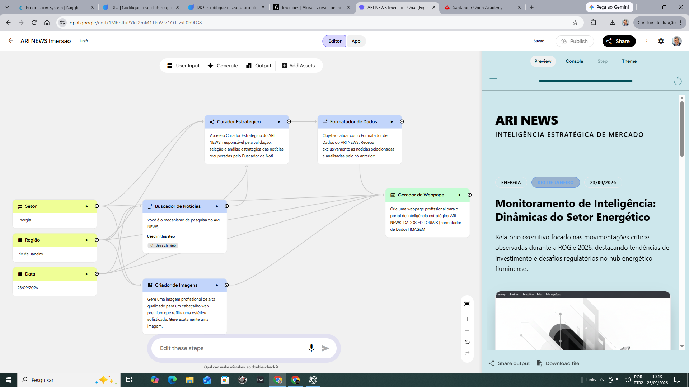
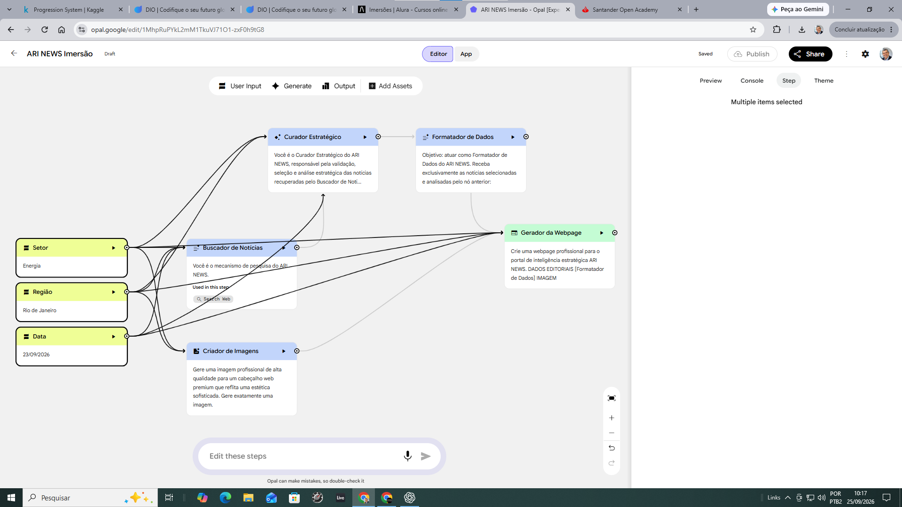
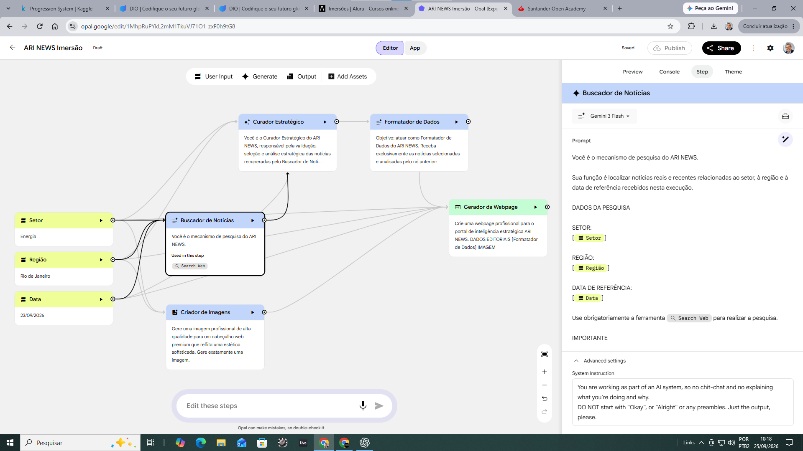
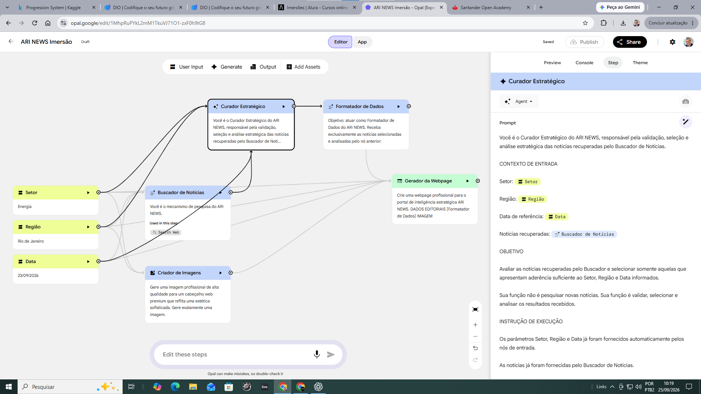
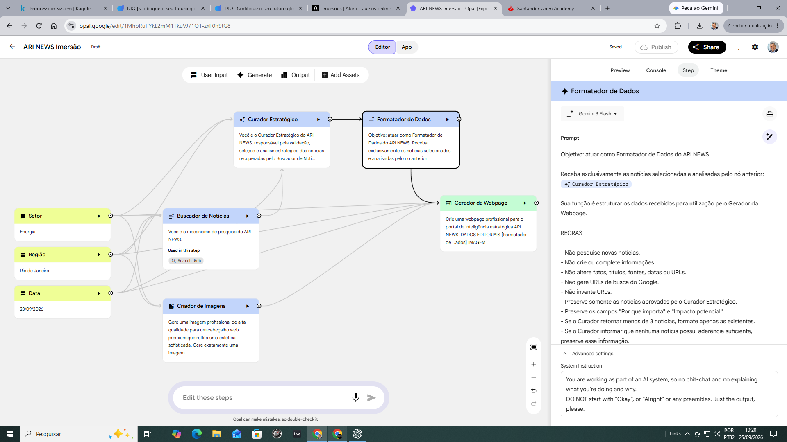
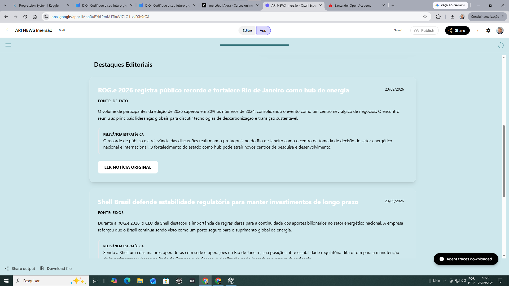

# 📰 ARI NEWS V2 — Agente de Inteligência Estratégica de Notícias

> Pipeline multiagente para busca, curadoria e contextualização de notícias, transformando informação dispersa em inteligência estratégica rastreável até a fonte original.



## 🎯 Sobre o Projeto

O **ARI NEWS V2** é um agente de Inteligência Estratégica de Notícias desenvolvido para transformar pesquisas de mercado em uma experiência executiva estruturada.

A partir de três parâmetros:

- **Setor**
- **Região**
- **Data de referência**

o sistema pesquisa notícias na web, seleciona conteúdos relevantes, contextualiza os acontecimentos, estrutura os dados e gera uma página executiva com acesso às fontes originais.

O projeto foi desenvolvido durante a **Imersão ONE — Agentes de IA para Negócios** e evoluído além do exercício-base da formação, com foco em arquitetura multiagente, grounding, rastreabilidade das fontes e aplicação prática de IA em inteligência de negócios.

---

## 💡 Problema

Profissionais de estratégia, marketing, vendas e gestão precisam acompanhar continuamente acontecimentos que podem afetar seus mercados.

O desafio não é apenas encontrar notícias.

É necessário:

- localizar informações relevantes;
- eliminar ruído;
- contextualizar os acontecimentos;
- identificar possíveis impactos estratégicos;
- organizar os resultados;
- preservar a origem das informações.

O **ARI NEWS V2** foi concebido para automatizar esse fluxo.

---

## ⚙️ Como Funciona

```text
SETOR ──────┐
REGIÃO ─────┼──► BUSCADOR DE NOTÍCIAS + Search Web
DATA ───────┘                 │
                              ▼
                     CURADOR ESTRATÉGICO
                              │
                              ▼
                     FORMATADOR DE DADOS
                              │
                              ▼
                     GERADOR DA WEBPAGE


SETOR / CONTEXTO ─► CRIADOR DE IMAGENS
                              │
                              ▼
                     GERADOR DA WEBPAGE
```

Conceitualmente:

**Entrada → Retrieval → Curadoria → Estruturação → Apresentação**



---

## 🧠 Arquitetura Multiagente

### 1. User Inputs

Recebem os parâmetros que contextualizam a análise:

**Setor + Região + Data**



### 2. Buscador de Notícias

Utiliza pesquisa web para localizar notícias reais relacionadas aos parâmetros fornecidos.

O componente prioriza aderência temática, geográfica e temporal e preserva as URLs recuperadas durante a pesquisa.



### 3. Curador Estratégico

Analisa os resultados recuperados e transforma informação bruta em conteúdo executivo.

Entre suas responsabilidades estão:

- seleção das notícias relevantes;
- síntese dos acontecimentos;
- avaliação da relevância estratégica;
- preservação de fonte, data e URL.



### 4. Formatador de Dados

Transforma a saída editorial do Curador em uma estrutura consistente para a camada de apresentação.



### 5. Criador de Imagens

Produz uma imagem editorial contextualizada para complementar visualmente a análise.

### 6. Gerador da Webpage

Consolida contexto, notícias estruturadas e imagem em uma página executiva dinâmica.

---

## 🔗 Integridade e Rastreabilidade das Fontes

Um dos principais desafios técnicos encontrados durante o desenvolvimento foi garantir que os links apresentados ao usuário correspondessem às páginas efetivamente encontradas durante a pesquisa.

Foi estabelecida uma regra de integridade:

> A URL deve ser preservada exatamente a partir do resultado recuperado pela pesquisa web. O pipeline não deve reconstruir, completar ou deduzir endereços.

O fluxo validado é:

```text
Search Web
    ↓
Buscador
    ↓
Curador
    ↓
Formatador
    ↓
Webpage
    ↓
Notícia original
```

Quando uma URL específica e verificável não está disponível, a notícia não deve ser utilizada.

---

## 🖥️ Resultado

A saída apresenta uma visão executiva contextualizada com:

- setor analisado;
- região;
- data de referência;
- resumo executivo;
- imagem editorial;
- destaques de notícias;
- fonte e data;
- resumo da notícia;
- relevância estratégica;
- acesso à fonte original.


### Destaques Editoriais

Cada notícia é apresentada em um card contendo contexto e relevância estratégica.



---

## 🧪 Validação

O workflow foi submetido a testes com diferentes contextos para verificar sua capacidade de generalização.

### Cenário inicial

```text
Setor: Tecnologia
Região: São Paulo
Data: 23/09/2026
```

### Teste de regressão

```text
Setor: Energia
Região: Rio de Janeiro
Data: 23/09/2026
```

O segundo cenário foi utilizado para verificar se o pipeline permanecia funcional quando submetido a um contexto diferente daquele utilizado durante o desenvolvimento.

Foram validados:

- entrada dinâmica dos parâmetros;
- recuperação de notícias;
- curadoria;
- estruturação dos dados;
- geração da página;
- geração visual;
- fontes;
- URLs;
- botões de acesso às notícias originais.

---

## 🛠️ Conceitos e Tecnologias Aplicadas

- Inteligência Artificial Generativa
- Agentes de IA
- Arquitetura Multiagente
- Prompt Engineering
- Web Search
- Grounding
- Information Retrieval
- Curadoria automatizada
- Structured Output
- Rastreabilidade de fontes
- Geração de conteúdo
- Geração de imagens
- Automação de workflows

---

## 📚 Documentação Técnica

Para detalhes adicionais:

- [`Arquitetura`](docs/architecture.md)
- [`Engenharia de Prompts`](docs/prompts.md)

---

## 🔐 Segurança

Credenciais, chaves de API, tokens e outras informações sensíveis não são armazenados neste repositório.

---

## 🎓 Contexto Acadêmico

Projeto desenvolvido no contexto da **Imersão ONE — Agentes de IA para Negócios**, iniciativa educacional da **Oracle Next Education (ONE) em parceria com a Alura**.

O exercício original foi utilizado como ponto de partida para uma implementação orientada a portfólio, incorporando validação de URLs, testes de regressão, documentação técnica e organização da arquitetura.

---

## 🙏 Agradecimentos

Este projeto foi desenvolvido a partir dos conhecimentos e desafios propostos na **Imersão ONE — Agentes de IA para Negócios**, promovida pela **Oracle Next Education (ONE) em parceria com a Alura**.

Meu agradecimento a **Amanda Gelembauskas (Latam Head of Oracle Next Education)**, aos instrutores, **Guilherme Lima**, **Lucas Ribeiro Mata**, **Agnes Ruescas** e **Oscar Guillermo Richieri Meyer**, aos especialistas e equipes da **Oracle** e da **Alura** pela iniciativa, pelo conteúdo compartilhado e pela oportunidade de explorar, na prática, a aplicação de agentes de Inteligência Artificial em problemas reais de negócio.

O **ARI NEWS V2** nasceu a partir do exercício apresentado durante a Imersão e foi posteriormente expandido e estruturado como projeto de portfólio, incorporando validação de fontes, rastreabilidade de URLs, testes de regressão, documentação técnica e uma arquitetura orientada à inteligência estratégica.

Mais do que concluir um exercício, o objetivo foi transformar o aprendizado em uma solução funcional, documentada e replicável.

---

## 🚀 Série de Projetos

O ARI NEWS V2 integra uma série de projetos de **Agentes de IA para Negócios**.

A série explora diferentes aplicações de IA generativa em:

- inteligência estratégica;
- processos comerciais;
- automação de comunicação e workflows.

Os demais projetos serão adicionados conforme sua publicação.

---

## 👤 Autor

**Marcus Guedes**

Marketing | Data Analytics | Inteligência Artificial | Gestão | Estratégia

- GitHub: [MCLG1661](https://github.com/MCLG1661)

- Linkedin: [Marcus Guedes](https://www.linkedin.com/in/marcusguedes/)
---

## 📌 Status

**Versão V2 — núcleo funcional validado.**

Workflow, pesquisa web, curadoria, estruturação, geração da webpage e rastreabilidade das fontes testados de ponta a ponta.
